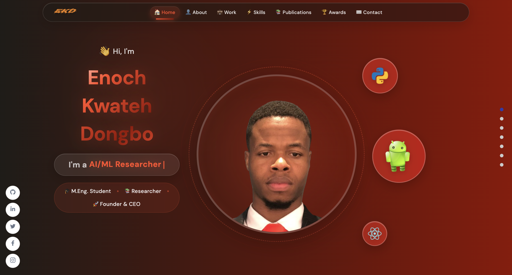

# 🚀 Enoch Kwateh Dongbo Portfolio

> A modern, full-stack portfolio application showcasing professional work, research publications, awards, and technical expertise with a beautiful glassmorphism design system.

[](https://reactjs.org/)
[](https://www.framer.com/motion/)
[](https://nodejs.org/)
[](https://orcid.org/)

## ✨ Features

### 🎨 Modern UI/UX

- **Glassmorphism Design System** - Stunning glass-morphic cards with backdrop filters and gradient effects
- **Smooth Animations** - Framer Motion with spring physics for buttery-smooth transitions
- **Responsive Layout** - Optimized for mobile, tablet, and desktop viewing
- **Interactive Components** - Hover effects, animated cards, and dynamic content loading

### 📚 Dynamic Content Sections

- **Publications** - 5 unique card types (Publications, Employment, Peer Reviews, Funding, Education) with ORCID integration
- **Awards & Certificates** - Grid view with pagination and trophy icons
- **Skills & Technologies** - Comprehensive tech stack showcase
- **Work Portfolio** - Project showcase with filtering and descriptions
- **About Section** - Personal and professional information
- **Contact** - Direct links to email, phone, and contact form

### 🔬 ORCID API Integration

- Real-time peer review fetching from ORCID (0009-0005-5213-9834)
- Dynamic journal name mapping (Physica Scripta, Knowledge-Based Systems)
- Automatic verification status display
- Live publication data synchronization

### 🎯 Interactive Features

- Animated typewriter effect in header with rotating titles
- Profile flip card with personal information
- Download resume functionality
- Grid/Carousel view toggles for awards
- Smooth scrolling navigation with active indicators
- Social media integration

### 🛠️ Admin Dashboard

- Content management for all sections
- Image upload and management
- Real-time preview
- Protected authentication

## 🖼️ Screenshots

<p align="center">
  
  <em>Modern glassmorphism header with animated typewriter effect</em>
</p>

<p align="center">
  
  <em>Enhanced contact section with profile flip card</em>
</p>

## 🚀 Getting Started

### Prerequisites

- Node.js (v16 or higher)
- npm or yarn
- Git

### Installation

1. **Clone the repository**

   ```bash
   git clone https://github.com/Hetawk/sanity-react-blog.git
   cd sanity-react-blog
   ```

2. **Install dependencies**

   ```bash
   npm install
   ```

3. **Set up environment variables**
   Create a `.env` file in the root directory:

   ```env
   REACT_APP_API_URL=your_backend_api_url
   REACT_APP_SANITY_PROJECT_ID=your_sanity_project_id
   REACT_APP_SANITY_TOKEN=your_sanity_token
   ```

4. **Start the development server**

   ```bash
   npm start
   ```

5. **Access the application**
   Open [http://localhost:3000](http://localhost:3000) in your browser

### Backend Setup (Optional)

If you need to set up the backend API:

```bash
cd api
npm install
node server.js
```

## 🛠️ Tech Stack

### Frontend

- **React 19.2.0** - UI library
- **Framer Motion 12.23.22** - Animation library with spring physics
- **React Router DOM** - Client-side routing
- **React Icons** - Icon library
- **SCSS** - Styling with variables and mixins

### Backend & CMS

- **Node.js** - Runtime environment
- **Express.js** - Backend API framework
- **Sanity CMS** - Resume file storage and dashboard content management
- **MySQL** - Database for portfolio data

### APIs & Integrations

- **ORCID API** - Academic publication and peer review data
- **RESTful API** - Custom backend endpoints

### Design System

- **Glassmorphism** - Modern UI design pattern
- **CSS Custom Properties** - Dynamic theming
- **Backdrop Filter** - Glass effect
- **Linear Gradients** - Color transitions
- **Box Shadows** - Depth and elevation

## 📁 Project Structure

```
portfolio/
├── public/                 # Static files
├── src/
│   ├── api/               # API client configuration
│   ├── assets/            # Images, icons, and media
│   ├── components/        # Reusable components
│   │   ├── Navbar/
│   │   ├── AnimatedName/
│   │   ├── TypewriterEffect/
│   │   └── ResumeDownload/
│   ├── container/         # Main section components
│   │   ├── Header/
│   │   ├── About/
│   │   ├── Work/
│   │   ├── Skills/
│   │   ├── OrcidWorks/
│   │   ├── Awards/
│   │   └── Footer/
│   ├── pages/             # Page components
│   │   ├── Dashboard/     # Admin dashboard
│   │   └── Contact/
│   ├── context/           # React context
│   ├── wrapper/           # HOC wrappers
│   └── constants/         # Constants and config
├── api/                   # Backend server
├── docs/                  # Documentation (gitignored)
└── scripts/               # Utility scripts (gitignored)
```

## 🎨 Key Design Features

### Glassmorphism Cards

All major components use a consistent glassmorphism design:

```scss
background: linear-gradient(
  135deg,
  rgba(255, 255, 255, 0.95) 0%,
  rgba(255, 255, 255, 0.9) 100%
);
backdrop-filter: blur(10px);
border: 1px solid rgba(255, 255, 255, 0.3);
box-shadow: 0 8px 32px rgba(255, 76, 41, 0.15), inset 0 1px 0 rgba(255, 255, 255, 0.6);
```

### Animation System

Smooth animations using Framer Motion:

```javascript
initial={{ opacity: 0, y: 50 }}
whileInView={{ opacity: 1, y: 0 }}
transition={{
  type: "spring",
  stiffness: 100,
  duration: 0.5
}}
```

### Brand Colors

```scss
--primary-color: #edf2f8; // Background
--secondary-color: #ff4c29; // Primary accent (orange)
--dark-color: #8e0e00; // Dark accent
--very-dark: #1f1c18; // Very dark accent
```

## 📊 Performance Optimizations

- ✅ Code splitting with React.lazy()
- ✅ Image optimization and lazy loading
- ✅ Memoized components with React.memo()
- ✅ Efficient re-renders with useCallback and useMemo
- ✅ Smooth 60fps animations with GPU acceleration
- ✅ Optimized bundle size

## 🔐 Environment Variables

Required environment variables:

```env
# API Configuration
REACT_APP_API_URL=http://localhost:5000

# Sanity CMS (Required for Resume & Dashboard)
REACT_APP_SANITY_TOKEN=your_sanity_token

# ORCID Configuration
REACT_APP_ORCID_ID=0009-0005-5213-9834
```

## 🚢 Deployment

### Build for Production

```bash
npm run build
```

This creates an optimized production build in the `build/` directory.

### Deploy to Vercel

```bash
npm install -g vercel
vercel
```

### Deploy to Netlify

```bash
npm run build
# Upload the build/ directory to Netlify
```

## 🤝 Contributing

Contributions, issues, and feature requests are welcome!

1. Fork the project
2. Create your feature branch (`git checkout -b feature/AmazingFeature`)
3. Commit your changes (`git commit -m 'Add some AmazingFeature'`)
4. Push to the branch (`git push origin feature/AmazingFeature`)
5. Open a Pull Request

## 📝 License

This project is open source and available under the [MIT License](LICENSE).

## 👨‍💻 Author

**Enoch Kwateh Dongbo**

- Website: [ekddigital.com](https://www.ekddigital.com)
- Email: ekd@ekddigital.com
- Phone: +86 185 0683-2159
- ORCID: [0009-0005-5213-9834](https://orcid.org/0009-0005-5213-9834)

## 🙏 Acknowledgments

- Special thanks to [Javascript Mastery](https://www.youtube.com/watch?v=3HNyXCPDQ7Q) for inspiration
- [Framer Motion](https://www.framer.com/motion/) for amazing animation library
- [ORCID](https://orcid.org/) for providing academic data API
- [React Icons](https://react-icons.github.io/react-icons/) for comprehensive icon set

---

<p align="center">Made with ❤️ by Enoch Kwateh Dongbo</p>
