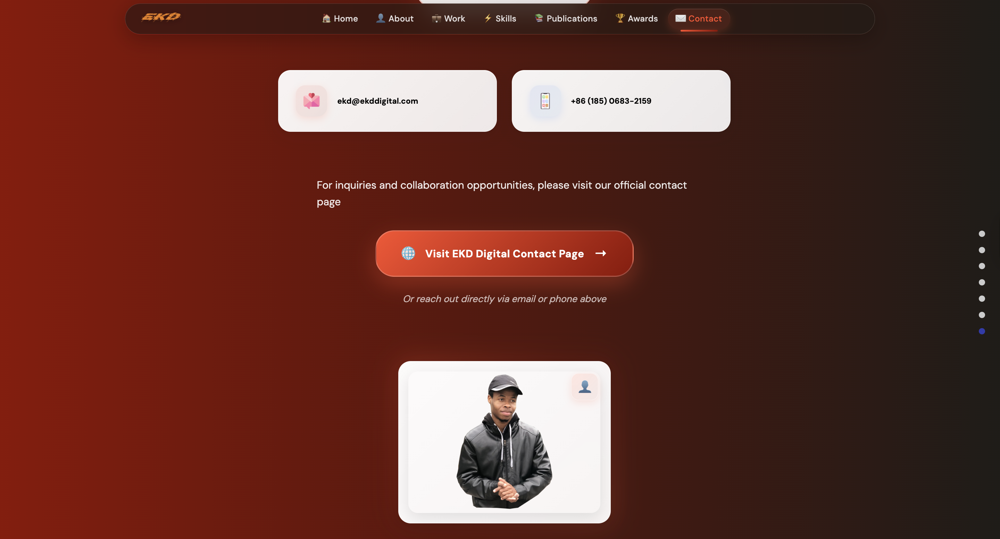

# Sanity-React Portfolio

## About

This React-Sanity portfolio is a showcase of my personal work and experiences.

### Special Thanks
All thanks to [Javascript Mastery](https://www.youtube.com/watch?v=3HNyXCPDQ7Q) for being a constant source of inspiration and guidance throughout the development of this portfolio.

## Screenshots

<p align="center">
  
  
</p>

## How to Run the App

### Client Side

```bash
npm install      # Install required packages
npm run start    # Start the client-side application from the root directory

# Navigate to the backend_sanity directory from the root
cd backend_sanity  

# Install npm packages
npm install       

# Run the sanity start command to start the sanity studio
sanity start       

